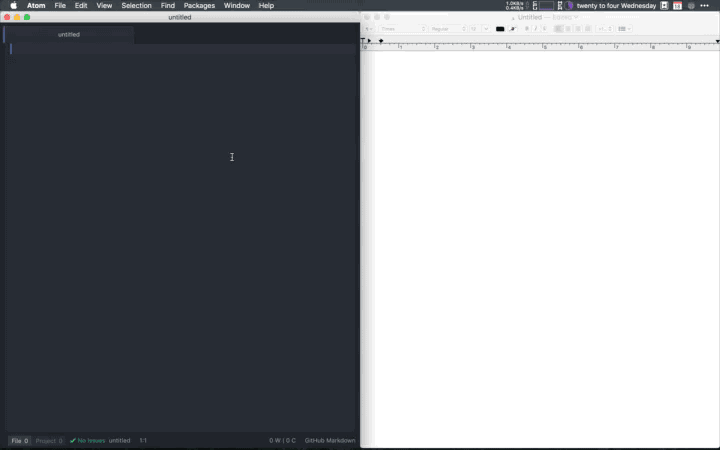

# Markboard for Atom

Markboard is an Atom package for Mac OS X that copies Markdown to the system clipboard as formatted text. When working in a Markdown view, press `Ctrl+Alt+C` to fire the command. Your file will be converted to HTML using Atom's internal Markdown renderer and copied, ready for use in any application that accepts pasted rich text.

## TODO
- [ ] Package tests.
- [ ] Compatibility with other operating systems than OS X.
